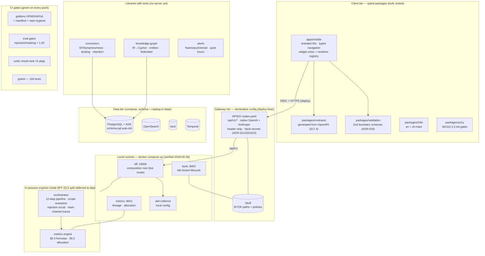

# Sales Northstar

Enterprise sales intelligence assistant — a secure, mobile-first, multi-agent platform that turns CRM, target, activity, organizational, and market data into a conversational, self-configurable dashboard. CRM-agnostic, deployable in a private cloud or enterprise VPC.

**Status:** Phases 0–4 built (repo-side); local stack runs end-to-end. Specification: [`prd-v1.md`](prd-v1.md) (v3.2 consolidated). Working plan: [`todo.md`](todo.md). AI coding standard: ZCode (`AGENTS.md`, ADR-027).

> **System snapshot v1.0 — 27 September 2026.** The diagrams below show the system **as built in this repository** (not the aspirational PRD target): what runs in the local Docker Compose stack, what is wired in-process, and what remains deploy-time. Verify current state with `uv run pytest -q`, `pnpm turbo check test`, and `docker compose up -d bff metrics byok`.

## Key documents

| Document | Purpose |
|---|---|
| [`prd-v1.md`](prd-v1.md) | Product proposal and detailed technical specification |
| [`todo.md`](todo.md) | Build log and plan — all activities by phase |
| [`docs/reviews/prd-v1-review.md`](docs/reviews/prd-v1-review.md) | PRD review: strengths, findings, open decisions |
| [`docs/adr/`](docs/adr/README.md) | Architecture decision records (ADR-021–036) |
| [`docs/runbooks/`](docs/runbooks/README.md) | Operational runbooks (Phase 1, Sprint 6) |
| [`docs/development/zcode-toolchain.md`](docs/development/zcode-toolchain.md) | ZCode AI-assisted engineering standard and onboarding |
| [`AGENTS.md`](AGENTS.md) | Repository-wide ZCode instructions and non-negotiable controls |

## Repository structure

```
apps/
  mobile/             React Native 0.87+ app, Strict TypeScript (PRD §12, §17)
  admin/              Web administration portal (BYOK, metrics, connectors, audit)
packages/
  contracts/          Generated OpenAPI 3.1 → TypeScript types and transport
  validation/         Zod runtime schemas for all untrusted boundaries
services/
  bff/                Mobile BFF (FastAPI) — publishes the product API
  orchestrator/       Agent orchestrator (LangGraph) + agent roster
  metrics/            Certified semantic metrics service
  knowledge-graph/    Graph + hybrid retrieval service
  byok/               BYOK credential lifecycle service
  connectors/         CRM / target-plan / news ingestion
data/
  canonical-model/    Canonical entity schemas (effective-dated org model)
  semantic-layer/     Governed metric catalog, fiscal calendars
  quality/            Reconciliation and data-quality tests
infra/
  apisix/             Apache APISIX API + AI gateway (sole north–south gateway)
  vault/              HashiCorp Vault paths and policies (BYOK secrets)
  k8s/                Kubernetes manifests, Gateway API, NetworkPolicy
  temporal/           Temporal workflow infrastructure (controlled actions)
  observability/      OpenTelemetry, metrics, dashboards
tools/
  codegen/            OpenAPI → TypeScript contract pipeline
  zcode/              Reviewed ZCode commands and delivery skill
tests/
  golden/             Permission and gateway conformance suites
  evals/              AI evaluation datasets and harnesses
docs/
  adr/                Architecture decision records
  reviews/            Specification reviews
  runbooks/           Operational runbooks
```

Each directory contains a README describing its purpose, the governing PRD sections, and its owning build track in [`todo.md`](todo.md).

## Current system — as built (v1.0, 27 September 2026)



**Build-state key:** solid nodes are running code with tests; the gateway tier is complete declarative configuration exercised by conformance goldens against recorded provider fixtures; data tier containers are wired in Compose with the canonical schema auto-loaded.

## Current data flow — as built (v1.0, 27 September 2026)

```mermaid
flowchart LR
    subgraph SOURCES["Sources (untrusted input, §11.2)"]
        SF["Salesforce CDC"]
        D365["Dynamics 365 change tracking"]
        NEWS["Licensed news feeds"]
        ORG["IdP / HR org hierarchy"]
    end

    subgraph INGEST["connectors — ADR-031"]
        TR["transforms<br/>unmapped → quarantine, never default<br/>minor units at boundary"]
        LAND["RawLanding<br/>idempotent by event id"]
        RECON["reconciliation<br/>tolerance breach blocks release (§23.1)"]
        RIGHTS["news rights enforcement<br/>unlicensed excluded at ingestion"]
        DEDUP["SimHash dedup clusters"]
        ENT["entity resolution<br/>alias→canonical, abstains below 0.7"]
        RET["retention engine<br/>DPIA schedule · deletion propagation"]
        TR --> LAND --> RECON
        NEWS --> RIGHTS --> DEDUP --> ENT
        TR --> RET
    end

    subgraph CANONICAL["data/ — governed"]
        SCHEMA[("canonical-model/schema.sql<br/>effective-dated · DomainGroupMembership allocation")]
        CATALOG[("semantic-layer/metric-catalog.yaml<br/>14 governed metrics + versions")]
    end

    subgraph PIPE["orchestrator — 12-step pipeline (§9.2)"]
        SCOPE["1-5 scope resolve + authorize<br/>RBAC/ReBAC · device posture"]
        QUERY["6-7 semantic query only<br/>no LLM→DB (GA-05)"]
        SCRUB["injection scrub<br/>retrieved text = data (GA-01)"]
        COMP["8-9 typed components<br/>+ citations"]
        MASK["10 output recheck<br/>out-of-scope evidence masked"]
        CONF["11 writes need confirmation"]
        TRACE["12 hash-chained trace"]
        SCOPE --> QUERY --> SCRUB --> COMP --> MASK --> CONF --> TRACE
    end

    BFFS["bff serialize → §19.3 wire shape"]
    GEN["contracts schema.d.ts<br/>(openapi-typescript, drift-checked)"]
    ZOD["Zod validation (ADR-026)"]
    WIDG["widget union → exhaustive renderers<br/>+ table alternatives (ADR-036)"]

    SF --> TR
    D365 --> TR
    ORG --> SCOPE
    LAND --> SCHEMA
    SCHEMA --> CATALOG
    CATALOG --> QUERY
    TRACE --> BFFS --> GEN --> ZOD --> WIDG
    ENT -->|"signals + provenance"| QUERY

    subgraph CRED["BYOK credential flow (ADR-023)"]
        REG["register → verify → store"]
        VLT[("Vault")]
        ACT["activate after probe<br/>fail-closed resolve"]
        REG --> VLT --> ACT
    end
    ACT -.->|"server-side key injection"| GWY["APISIX ai-proxy (deploy)"]

    GOLD2["goldens + evals gate every stage above"]
```



**What the flow proves today:** a question through the BFF executes the real pipeline — scope token → governed metrics (attainment 60% v3 from the certified engine) → typed §19.3 components → masked/quoted evidence → hash-chained trace — verified live on 2026-09-26 and pinned by 184 Python tests plus the GPM/GW/GA golden suites.

## Architecture baseline

- **Apache APISIX** is the sole north–south API and AI gateway with two first-class native LLM routes (OpenAI Chat Completions; Anthropic Messages) — [ADR-021](docs/adr/ADR-021-apisix-single-api-ai-gateway.md), [ADR-022](docs/adr/ADR-022-separate-native-llm-contracts.md).
- **Enterprise BYOK**: provider keys live only in HashiCorp Vault; fail-closed lifecycle controls — [ADR-023](docs/adr/ADR-023-byok-vault-fail-closed.md).
- **Mobile** is React Native with the Strict TypeScript API and generated end-to-end contracts — [ADR-025](docs/adr/ADR-025-react-native-strict-typescript-contracts.md).
- Dynamic agent/dashboard/graph payloads are runtime-validated — [ADR-026](docs/adr/ADR-026-runtime-schema-validation.md); cross-protocol conversion is opt-in — [ADR-024](docs/adr/ADR-024-opt-in-cross-protocol-conversion.md).
- **AI-assisted engineering** uses ZCode under root `AGENTS.md`, [ADR-027](docs/adr/ADR-027-zcode-ai-engineering-workbench.md), reviewed repository workflows, risk-tiered execution modes, and independent CI verification.

## Delivery phases

Phase 0 discovery (2 weeks) → Phase 1 MVP (10–14 weeks, 6 sprints, tracks A–H) → Phase 2 production hardening (8–12 weeks) → Phase 3 optimization (ongoing) → Phase 4 production readiness & closure (repo extension). Details, checklists, and acceptance gates: [`todo.md`](todo.md).

## License

See [LICENSE](LICENSE).
