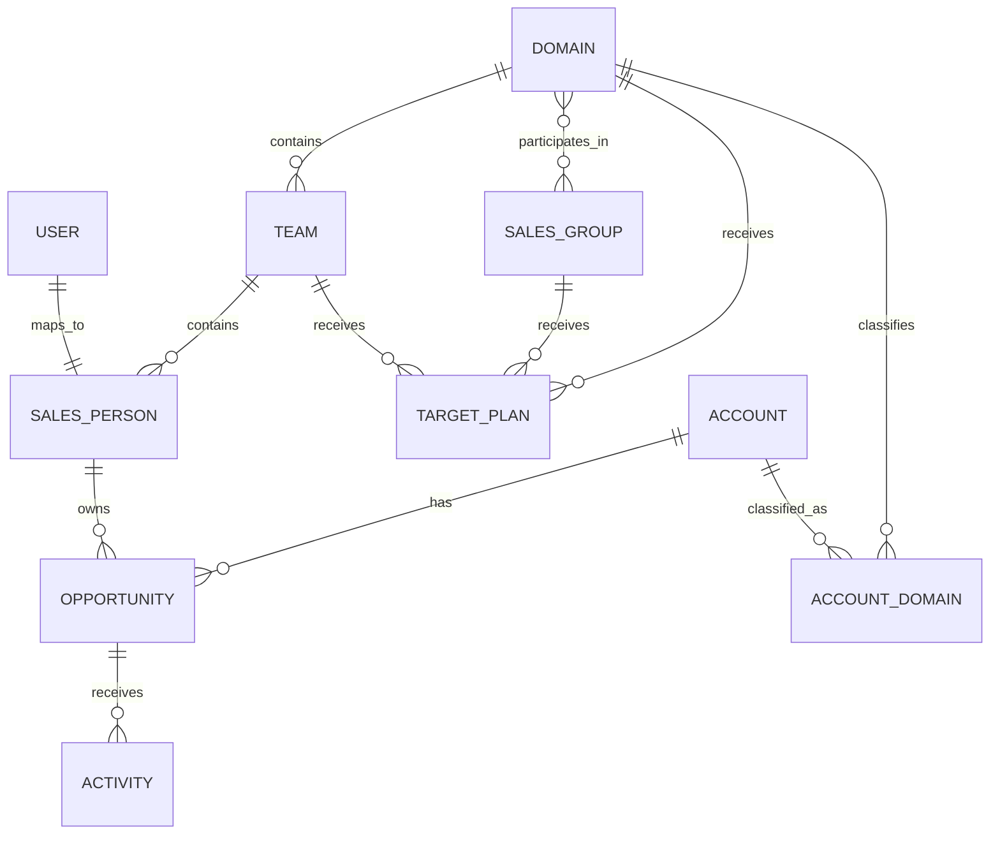
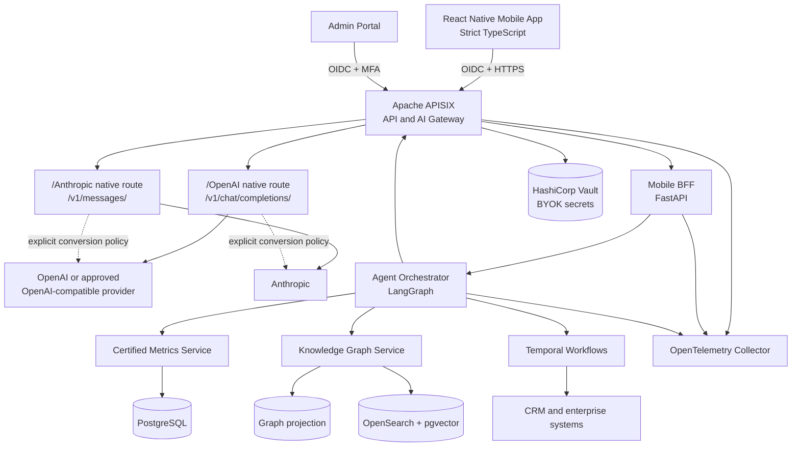
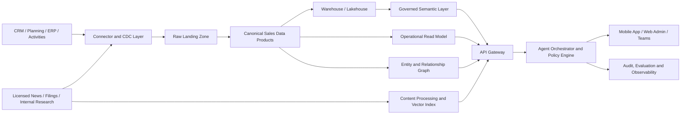
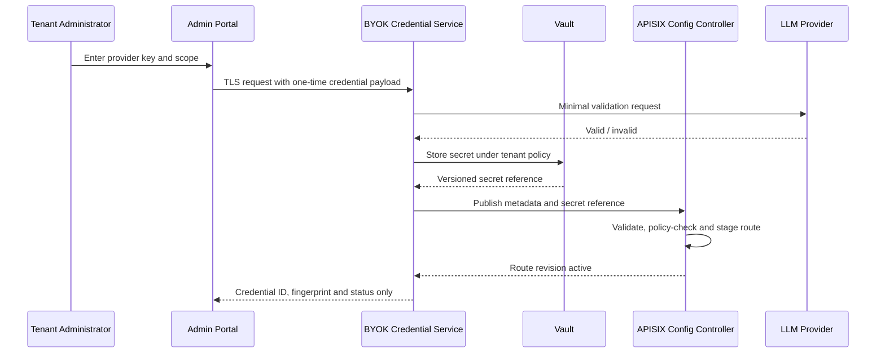
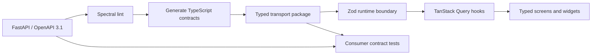

# Sales Northstar — Enterprise Sales Intelligence Assistant

## Product Proposal and Detailed Technical Specification

**Version:** 3.2 (consolidated)
**Status:** Proposed production baseline
**Date:** 26 September 2026
**Supersedes:** Product Proposal v1.0; Technical Architecture and Engineering Specification v2.1; consolidated baseline v3.0; v3.1 (ZCode toolchain)

This document consolidates the product proposal and the engineering specification for **Sales Northstar** into a single baseline. Part I covers the product: problem, users, organization model, journeys, functional requirements, agent architecture, and governance. Part II covers the technical baseline: data architecture, the Apache APISIX AI gateway, enterprise BYOK, mobile engineering standards, knowledge-graph integration, APIs, testing, and non-functional requirements. Part III covers delivery: plan, team, backlog, acceptance criteria, risks, and commercial framing.

---

# Part I — Product Proposal

## 1. Executive proposition

Sales Northstar is a secure, mobile-first, multi-agent sales intelligence platform that turns CRM, target, activity, organizational, and external market data into a conversational, self-configurable dashboard. Each seller receives a permission-aware view of personal pipeline, target versus plan, risks, recommended actions, and relevant market intelligence; managers receive rolled-up team, domain, and group views without exposing records beyond their authorized scope.

The product is CRM-agnostic, deployable in a private cloud or enterprise VPC, and delivered initially as a 12–16 week MVP. It augments — rather than replaces — the systems of record. Comparable sales assistants already demonstrate demand for natural-language access to CRM data, record and opportunity summaries, meeting preparation, recent-change detection, and account news.[^1][^2][^3] The differentiator is the combination of governed organizational roll-ups, multi-agent reasoning, explainable metrics, market intelligence, and a dashboard that users can configure directly through conversation on mobile.

## 2. Business problem

Sales information is typically fragmented across CRM records, spreadsheets, target-planning systems, email, meetings, BI tools, and external news sources. This creates four operational gaps:

- **Limited situational awareness:** sellers cannot quickly determine which opportunities need attention, how likely they are to hit target, or where forecast gaps exist.
- **Slow management roll-up:** managers spend time reconciling seller, team, domain, and group numbers, particularly where a domain participates in more than one group.
- **Context switching:** CRM, email, activity, targets, product data, and market news appear in separate applications.
- **Low actionability:** conventional dashboards describe what happened but do not explain why, identify next-best actions, or complete approved workflow steps.

Mobile BI products validate the value of live, interactive dashboards, touch interaction, alerts, and natural-language querying on mobile devices; however, conventional mobile BI primarily supports viewing and interacting rather than conversational creation of dashboard content.[^4][^5][^6] Sales Northstar closes that gap by allowing an authorized user to ask, for example, "Create a weekly view of my top ten renewal risks, target gap, and relevant telecom news," and then save the generated cards as a dashboard.

## 3. Objectives and outcomes

### 3.1 Product objectives

1. Provide every seller with a trusted, up-to-date view of pipeline, attainment, forecast, activities, and market context.
2. Enable conversational analysis with charts, graphs, tables, narrative summaries, and drill-through to source records.
3. Support governed roll-ups across **seller → team → domain ↔ group**.
4. Recommend and, with approval, execute sales actions through constrained tools.
5. Deliver a self-configurable mobile dashboard without allowing users to bypass metric definitions or data permissions.
6. Establish evidence, auditability, and human oversight for every material AI-generated recommendation.

### 3.2 Target business outcomes

The baseline must be measured during discovery; no unsourced improvement percentage should be promised before telemetry exists. The MVP targets the following outcome categories:

- Reduced time spent preparing weekly pipeline and forecast reviews.
- Higher CRM data completeness and freshness.
- Earlier identification of stalled, slipping, or under-covered opportunities.
- Higher use of market intelligence in account planning.
- Better forecast calibration and reduced variance between submitted forecast and actual bookings.
- Faster manager intervention on target gaps and deal risks.
- Measurable adoption of conversational analytics and saved dashboards.

## 4. Scope and assumptions

### 4.1 Planning defaults

| Decision | Baseline |
|---|---|
| Product form | React Native mobile app (Strict TypeScript) plus responsive web administration |
| Data ecosystem | CRM-agnostic canonical model with first connectors for Salesforce and Microsoft Dynamics 365 |
| Deployment | Single-enterprise private cloud/VPC; on-premises connectors where required |
| AI gateway | Apache APISIX as sole north–south API and AI gateway with enterprise BYOK |
| Delivery | MVP in 12–16 weeks, followed by two production-hardening releases |
| AI posture | Retrieval-grounded generation; no training of public models on enterprise data |
| Languages | English first; Traditional Chinese in the next release, with architecture ready for multilingual retrieval |
| Record authority | CRM and planning systems remain systems of record; Northstar stores normalized analytical and operational projections |
| Actions | Read-only intelligence first; approved write-back actions introduced behind confirmation and policy controls |

### 4.2 MVP scope

- Seller, team-manager, domain-leader, group-leader, sales-operations, and administrator experiences.
- Personal and authorized roll-up dashboards.
- Pipeline health, target-versus-plan, forecast, coverage, activity, and stale-deal analytics.
- Account, company, industry, domain, competitor, and group news intelligence.
- Natural-language questions with chart/table/card generation.
- Conversational dashboard configuration, saved views, alerts, and scheduled briefings.
- CRM and target-plan connectors; configurable external news connectors.
- Evidence links, data freshness, metric definition, and "how calculated" views.
- Role- and relationship-based access control, audit logging, policy enforcement, and AI evaluation.

### 4.3 Deferred scope

- Fully autonomous outreach, price or discount commitments, contract negotiation, and unrestricted CRM write-back.
- Commission calculation, territory optimization, and quota allocation engines.
- Customer-facing chatbot functionality.
- Automated decisions about employee performance or compensation.
- Bespoke forecasting models before sufficient historical data and back-testing are available.

## 5. Users and permissions

| Persona | Primary need | Default scope | Key capabilities |
|---|---|---|---|
| Salesperson | Prioritize work and hit target | Own opportunities, assigned/shared accounts, own target | Personal dashboard, deal coaching, market brief, approved actions |
| Team manager | Coach team and manage forecast | Team members and team-owned records | Roll-up, compare, inspect exceptions, reassign/coach where authorized |
| Domain leader | Manage a business or industry domain | All teams in the domain | Domain plan, pipeline mix, market/industry intelligence |
| Group leader | Coordinate multiple domains | Domains linked to the group | Group roll-up with explicit allocation rules and deduplication |
| Sales operations | Govern data, metrics, plans, and reporting | Authorized enterprise analytical scope | Metric catalog, data quality, target administration, usage analytics |
| Executive | Monitor performance and risk | Authorized domains/groups | Compact scorecards, forecast scenarios, alerts |
| Platform administrator | Configure and operate the platform | Technical metadata; business data only by explicit grant | Connectors, models, policies, observability, incident response |
| Compliance/auditor | Verify access and AI behavior | Immutable logs and approved evidence | Audit searches, decision traces, policy and model-version history |

## 6. Organization model

The model must distinguish **organizational membership**, **record ownership**, and **reporting scope**. Conflating these concepts will create double counting and access leakage.



*Figure: Organization and reporting entity model*

### 6.1 Cardinality rules

- A salesperson has exactly one primary team at a point in time; effective-dated history supports transfers.
- A team belongs to exactly one domain at a point in time.
- A domain can belong to zero, one, or many groups.
- A group can contain one or many domains.
- An opportunity has one accountable owner but may have contributors through an opportunity-team relationship.
- Accounts may map to multiple domains if the business requires it; one mapping must be marked primary for default attribution.
- All membership and allocation relationships are effective-dated.

### 6.2 Multi-group attribution

Because a domain can belong to several groups, the same pipeline must not automatically be summed into an enterprise total more than once. Each `DomainGroupMembership` therefore contains:

- `membership_id`, `domain_id`, `group_id`.
- `valid_from`, `valid_to`, `status`.
- `reporting_role`: primary, secondary, overlay, virtual.
- `pipeline_allocation_pct` and `target_allocation_pct`.
- `aggregation_policy`: full-view, proportional-allocation, primary-only, or excluded-from-enterprise-total.

A group dashboard may show a full-view amount for operational visibility, but any cross-group enterprise aggregation must use the configured allocation policy. The UI must label every non-additive metric and expose its allocation rule.

## 7. Core journeys

### 7.1 Morning seller briefing

1. The Briefing Agent detects the seller's role, time zone, calendar, priority opportunities, target gap, recent CRM changes, and relevant news.
2. The mobile home screen displays "Today": attainment, forecast gap, top three risks, upcoming meetings, overdue actions, and two evidence-backed market signals.
3. The seller asks, "Why is my commit down this week?"
4. The Analytics Agent generates a variance waterfall and table of changed opportunities.
5. The seller opens one deal, reviews the source-backed explanation, and creates a follow-up task after confirmation.

### 7.2 Manager pipeline review

1. The manager asks, "Show coverage and forecast risk by salesperson for Q4."
2. The system applies the manager's team scope and approved metric definitions.
3. It returns a coverage bar chart, attainment/forecast matrix, and exception table.
4. The manager drills into a seller, asks for stalled opportunities over a configured threshold, and saves the view as "Monday Review."
5. A weekly alert is configured through conversation, with no need to edit a BI report.

### 7.3 Domain intelligence

1. A domain leader asks, "What changed this week in the data-centre market, and which open opportunities are affected?"
2. The Market Intelligence Agent retrieves approved news, validates dates and entities, clusters duplicate stories, and tags signals by opportunity/account relevance.
3. The Opportunity Agent maps signals to open deals using products, account entities, competitors, geography, and domain taxonomy.
4. The result separates sourced facts from AI interpretation and recommended actions.

### 7.4 Dashboard by conversation

1. The user says, "Build a compact dashboard with monthly attainment, weighted pipeline by stage, deals closing in 60 days, and fintech news."
2. The Dashboard Composer resolves metric names against the governed semantic catalog.
3. It proposes a mobile layout and previews filters, scope, date range, and chart choices.
4. The user confirms, rearranges cards by touch or speech, and saves the dashboard.
5. The dashboard definition is stored as declarative JSON and rendered consistently across devices.

## 8. Functional requirements

### 8.1 Conversational assistant

| ID | Requirement | Priority | Acceptance condition |
|---|---|---:|---|
| CONV-01 | Accept text input with follow-up context | Must | User can conduct a multi-turn session without repeating scope or date range |
| CONV-01V | Accept voice input with transcript confirmation | Should (Phase 2) | Transcript is shown for correction before submission; audio is processed transiently (ADR-032) |
| CONV-02 | Resolve business synonyms through a governed glossary | Must | "Bookings," "sales," and local terms map to configured metrics, or the system asks for disambiguation |
| CONV-03 | Return mixed components: narrative, KPI, chart, graph, table, source chips, and actions | Must | Response payload validates against the UI component schema |
| CONV-04 | Show query scope, filters, as-of time, currency, and metric definition | Must | Every analytical answer exposes these fields |
| CONV-05 | Maintain citations to source CRM records, plan rows, and news items | Must | User can open evidence if permitted; inaccessible source details remain masked |
| CONV-06 | Support "explain this," "show calculation," and "why recommended" | Must | Explanation includes formula, input set, rule/model, and material assumptions |
| CONV-07 | Refuse or safely redirect unsupported, unauthorized, or destructive requests | Must | Policy tests show no cross-scope disclosure or unapproved action execution |
| CONV-08 | Export an authorized result as image, PDF, CSV, or secure deep link | Should | Export preserves filters, timestamp, and classification marking |
| CONV-09 | Capture thumbs-up/down and structured correction feedback | Should | Feedback links to response, retrieval set, prompt/model version, and user role |

### 8.2 Pipeline intelligence

- Pipeline by stage, product, account, domain, geography, owner, source, age, close month, currency, and forecast category.
- Open, won, lost, slipped, newly created, reopened, and changed-value movements.
- Stage conversion, velocity, stage aging, stale opportunity, close-date push, value change, inactivity, missing stakeholder, and missing next-step indicators.
- Weighted and unweighted pipeline with explicit formulas.
- Pipeline coverage against remaining target.
- Forecast categories: pipeline, best case, commit, closed, and organization-specific equivalents.
- Deal health composed from transparent indicators; any machine-learned score must show key factors and calibration status.
- Scenario controls for close probability, date, amount, allocation, and FX rate without modifying source data.
- Drill-through to account, contacts, activities, products, quotes, competitors, notes, and evidence.

Current enterprise sales assistants summarize opportunity basics, expected revenue, close date, contacts, products, quotes, and competitors, which provides a useful baseline for the opportunity detail experience.[^7][^1] Northstar extends that baseline with governed forecast movement, target coverage, organizational roll-up, evidence-level lineage, and configurable analytics.

### 8.3 Target versus plan

The platform must support annual, quarterly, monthly, and custom fiscal periods. Target plans can be assigned to a seller, team, domain, group, product, or permitted combination.

Core measures include:

- `Actual`: recognized measure selected by policy, such as bookings, signed contract value, revenue, margin, or units.
- `Target`: approved quota or plan for the reporting period.
- `Attainment % = Actual / Target × 100`.
- `Remaining Target = max(Target − Actual, 0)`.
- `Weighted Pipeline = Σ(Opportunity Amount × Approved Probability)`.
- `Coverage = Relevant Open Pipeline / Remaining Target`.
- `Forecast Gap = Target − (Actual + Forecast)`.
- `Run Rate`: actual normalized by elapsed working or calendar days according to policy.
- `Required Run Rate`: remaining target divided by remaining working or calendar days.

Every formula must be governed in the metric catalog, including currency treatment, fiscal calendar, time grain, inclusion rules, stage mapping, probability source, and late-arriving data behavior.

### 8.4 Market intelligence

| Capability | Detailed behavior |
|---|---|
| Topic profiles | Users follow industries, companies, accounts, domains, products, competitors, regulations, and geographies |
| Ingestion | Licensed news feeds, approved web sources, company filings, internal research, and configured subscriptions |
| Entity resolution | Map aliases and subsidiaries to canonical company, account, competitor, domain, and group entities |
| Relevance | Score by recency, source quality, entity match, domain taxonomy, open opportunity, product, and user role |
| Deduplication | Cluster syndicated or substantially similar stories and select a canonical source |
| Signal taxonomy | Funding, leadership, expansion, procurement, regulation, partnership, earnings, incident, product launch, merger, risk, and intent |
| Summarization | Short factual summary, "why it matters," affected accounts/opportunities, and confidence |
| Evidence | Title, publisher, publication time, retrieved time, URL, excerpt metadata, and source license status |
| Controls | Source allow/deny lists, geography rules, retention, content classification, and unsupported-claim detection |

News updates and account-relevant summaries are already expected features in modern sales assistants.[^2] For Northstar, external content must be treated as untrusted input: retrieved text cannot supply agent instructions, select tools, or override policies.

### 8.5 Dashboard composer

The dashboard is a set of declarative cards, not free-form executable code. Supported components include:

- KPI and status cards.
- Horizontal/vertical bar, stacked bar, line, area, donut, waterfall, funnel, scatter, bubble, heat map, gauge, and bullet charts.
- Sortable, filterable tables with conditional formatting.
- Relationship graph linking sellers, teams, domains, groups, accounts, opportunities, competitors, and signals.
- News and recommended-action feeds.
- Narrative insight and anomaly cards.
- Saved prompt/action cards.

Users can create, edit, clone, rearrange, resize, filter, schedule, share, and delete dashboards through conversation or touch. The composer validates metric compatibility, chart suitability, authorization, mobile readability, and query cost before saving. Conventional Power BI mobile experiences are designed primarily for viewing and interaction rather than creation, reinforcing conversational mobile authoring as a meaningful product distinction.[^4]

### 8.6 Alerts and briefings

- Trigger types: threshold, percentage change, stage aging, inactivity, close-date movement, forecast category change, target gap, data quality, and new market signal.
- Delivery: in-app push, email, Teams, or enterprise notification service.
- Controls: quiet hours, frequency cap, digest mode, severity, snooze, acknowledgement, and escalation.
- Briefings: daily seller, weekly manager, domain market pulse, and executive exception digest.
- Every notification deep-links to a permission-checked view and records delivery/engagement telemetry.

### 8.7 Controlled actions

MVP actions should be low-risk and reversible:

- Create or update a task.
- Draft an email or meeting agenda without sending.
- Add a note.
- Update next step, close date, probability, or forecast category after explicit confirmation.
- Subscribe to a topic or alert.
- Share a secure dashboard link with authorized users.

The system must show a pre-execution summary, affected records, proposed field changes, and any downstream impact. High-impact actions require step-up authentication or manager approval. Bulk updates, messages sent externally, price changes, quote approvals, and contract actions remain out of scope until separate controls and testing are approved.

## 9. Agent architecture

### 9.1 Agent roster

| Agent | Responsibility | Allowed tools | Output |
|---|---|---|---|
| Orchestrator | Interpret intent, decompose work, enforce workflow | Policy check, agent router, session store | Approved execution plan |
| Identity & Scope Agent | Resolve user role, hierarchy, delegation, and data scope | IAM, relationship graph, policy engine | Scope token and masking policy |
| Sales Analytics Agent | Translate questions to governed metrics and queries | Semantic layer, analytical query service | KPIs, datasets, explanations |
| Opportunity Agent | Summarize deals, detect risks, and recommend next steps | CRM read, activity read, rules/model service | Deal brief and actions |
| Target & Forecast Agent | Calculate attainment, coverage, gap, and scenarios | Plan service, forecast service, semantic metrics | Plan/forecast components |
| Market Intelligence Agent | Retrieve, deduplicate, summarize, and link external signals | Search/feed gateway, entity graph, retrieval index | Cited signal objects |
| Dashboard Composer | Convert intent into valid dashboard definitions | Component registry, layout service, semantic catalog | Dashboard JSON |
| Action Agent | Prepare and execute approved write-back | Constrained CRM/workflow connectors | Preview, confirmation, receipt |
| Data Quality Agent | Identify missing, stale, conflicting, or anomalous data | Validation rules, lineage catalog | Quality warnings |
| Governance Agent | Apply safety, privacy, retention, and audit policy | Policy engine, content filters, audit service | Permit, transform, deny, escalate |

### 9.2 Orchestration pattern

Use a deterministic workflow around probabilistic models:

1. Authenticate user and device.
2. Classify intent and risk.
3. Resolve subject, scope, metric, filters, and time period.
4. Generate a structured execution plan.
5. Authorize every data query and tool call.
6. Retrieve data through semantic or record APIs; never allow direct LLM database access.
7. Validate data freshness, completeness, and query totals.
8. Generate typed UI components.
9. Attach citations, lineage, confidence, and warnings.
10. Recheck output for leakage, unsupported claims, and unsafe instructions.
11. Require confirmation or approval for write actions.
12. Record an immutable trace with sensitive content minimized.

### 9.3 Agent state

- **Session memory:** current conversation, selected dashboard, date range, and filters; short-lived and encrypted.
- **User preference memory:** saved dashboards, alert settings, preferred currency, chart preferences; explicit, editable, and deletable.
- **Enterprise knowledge:** governed definitions, sales playbooks, product catalog, domain taxonomy, approved sources, and policies.
- **No hidden behavioral memory:** the system must not infer sensitive employee traits or create undisclosed performance profiles.

## 10. Mobile experience

### 10.1 Information architecture

The primary navigation contains five destinations:

1. **Today:** briefing, alerts, target gap, priority actions.
2. **Ask:** full conversational assistant with voice, suggestions, and response components.
3. **Dashboard:** saved and shared self-configured dashboards.
4. **Pipeline:** searchable pipeline, opportunities, accounts, and drill-through.
5. **Intelligence:** followed topics, market signals, and news collections.

### 10.2 Interaction principles

- Thumb-reachable actions and one-handed use for common flows.
- Progressive disclosure: concise card first, details and evidence on demand.
- Charts open in a focus view with accessible data table equivalent.
- Voice input is optional; the transcript is shown before submission for correction.
- Offline mode caches only explicitly approved, encrypted, time-limited summaries; sensitive detail requires online reauthorization.
- Deep links are permission checked at open time, not only at share time.
- Device biometrics can support step-up authentication but do not replace enterprise identity policy.

### 10.3 Dashboard definition

```json
{
  "dashboard_id": "dash_monday_review",
  "title": "Monday Review",
  "scope": {"type": "team", "id": "team_12"},
  "global_filters": {"fiscal_period": "FY27-Q1", "currency": "HKD"},
  "layout": {"mode": "mobile_grid", "columns": 2},
  "cards": [
    {"type": "kpi", "metric": "attainment_pct", "position": [0,0,1,1]},
    {"type": "bullet", "metric": "forecast_vs_target", "position": [1,0,1,1]},
    {"type": "bar", "metric": "coverage", "dimension": "salesperson", "position": [0,1,2,2]},
    {"type": "table", "query": "stalled_opportunities", "position": [0,3,2,3]}
  ],
  "refresh_policy": "on_open",
  "sharing": "team_managers"
}
```

## 11. Security, privacy, and AI governance

A zero-trust design must authorize each user, device, workload, data object, and tool invocation rather than trust network location. NIST defines zero trust around protecting resources and performing authentication and authorization without implicit trust based on network location or ownership.[^8][^9]

### 11.1 Access model

Use combined RBAC, ABAC, and ReBAC:

- **RBAC:** base permissions by seller, manager, domain leader, group leader, operations, admin, auditor.
- **ABAC:** sensitivity, geography, employment status, device posture, purpose, time, and record classification.
- **ReBAC:** ownership, team membership, domain membership, group membership, account team, opportunity team, delegation, and temporary coverage.
- **Policy enforcement:** centralized policy decision point; enforcement at API gateway, semantic query service, retrieval service, and action connector.
- **Denied inference:** suppress small-group or filtered aggregates where values could reveal a restricted individual record.

### 11.2 AI protections

- Treat CRM notes, emails, attachments, websites, and news as untrusted content.
- Separate system instructions, business policy, user input, retrieved content, and tool results.
- Allowlist tools and validate typed arguments.
- Apply least-privilege service accounts and per-tool scope tokens.
- Use retrieval filters before content reaches the model.
- Apply output data-loss-prevention checks and field-level masking.
- Prevent retrieved content from changing instructions or invoking tools.
- Sandbox file parsing and scan attachments.
- Enforce human confirmation for write actions and approval for high-impact actions.
- Evaluate prompt injection, data exfiltration, excessive agency, privilege escalation, hallucination, and denial-of-wallet scenarios.

OWASP publishes both a Top 10 for LLM applications and a threat-model-oriented guide for agentic AI, so the security test plan maps controls and adversarial tests to those references.[^10][^11]

### 11.3 Hong Kong privacy alignment

For a Hong Kong deployment, governance aligns with the PDPO and the PCPD's Model Personal Data Protection Framework. The framework addresses AI strategy and governance, risk assessment and human oversight, model customization and system management, and communication with stakeholders.[^12][^13]

Required practices include:

- Executive-led AI governance committee and named product/data owners.
- Data protection impact assessment and AI risk assessment before production.
- Purpose limitation and data minimization for emails, contacts, activity, and employee analytics.
- Clear notices describing AI use, data categories, decisions, and human involvement.
- Risk-tiered human oversight and an appeal/correction process.
- Supplier due diligence, data-location assessment, subprocessors, deletion obligations, and incident terms.
- Validation before launch, continuous monitoring, periodic reassessment, and AI incident response.
- Anonymization or pseudonymization for evaluation datasets where appropriate; the PCPD recommends anonymizing personal data before feeding it into AI models where appropriate.[^14]

NIST's Generative AI Profile is also suitable as the enterprise-wide risk taxonomy because it is designed to help organizations identify generative-AI risks and select actions aligned to organizational priorities.[^15][^16]

### 11.4 Audit record

For each consequential response or action, record:

- User, role, device posture, and effective scope.
- User request and normalized intent, with sensitive content redacted where possible.
- Data sources, record IDs, query hashes, retrieval evidence, and freshness.
- Model, prompt, workflow, policy, metric, and dashboard-definition versions.
- Tool calls, arguments, authorization decisions, approvals, and execution receipt.
- Output classification, warnings, user feedback, and subsequent correction.

Audit logs must be tamper-evident, access-controlled, retention-governed, and searchable by incident, user, model, action, data source, and policy decision.

---

# Part II — Technical Architecture and Engineering Specification

## 12. Executive technical decision

Sales Northstar uses **Apache APISIX as the sole north–south API and AI gateway**. APISIX provides the required multi-provider proxying, token-aware controls, load balancing, retries, fallback, and AI request observability through its `ai-proxy`, `ai-proxy-multi`, and related plugins.[^17][^18][^19]

The gateway publishes two first-class, versioned LLM interfaces rather than forcing all clients through one normalized schema:

- `POST /ai/openai/v1/chat/completions` — OpenAI Chat Completions request, response, and SSE semantics.
- `POST /ai/anthropic/v1/messages` — Anthropic Messages request, response, content-block, tool-use, and SSE semantics.

APISIX supports native Anthropic Messages pass-through when the route ends in `/v1/messages`, preserving Anthropic-specific fields and streaming events. It can also convert Anthropic Messages requests to an OpenAI-compatible backend, but this specification makes such conversion an explicit, opt-in policy rather than the default.[^20][^21]

The mobile application uses **React Native with the Strict TypeScript API and a no-untyped-boundary engineering policy**. React Native projects target TypeScript by default, its Strict TypeScript API provides stronger and more future-proof type accuracy, and React Navigation can type-check screens and route parameters.[^22][^23][^24]

## 13. Solution architecture



*Figure: Solution architecture*

### 13.1 Trust boundaries

1. **Mobile trust boundary:** The application authenticates users but never receives, stores, or forwards provider API keys. It calls the Mobile BFF for sales functions; direct LLM endpoints are reserved for trusted platform workloads.
2. **Gateway boundary:** APISIX verifies workload or user identity, resolves the tenant and approved credential reference, removes sensitive inbound headers, enforces quota, and routes traffic.
3. **BYOK boundary:** Provider keys reside in Vault. Configuration stores only secret references and credential metadata.
4. **Agent boundary:** The LangGraph orchestrator plans bounded tasks but does not select arbitrary endpoints or credentials. It requests a logical capability such as `reasoning.standard` or `summarization.low_cost`.
5. **Data boundary:** Certified KPIs come from the semantic metrics service; market and entity context comes from the approved knowledge graph and hybrid retrieval services.
6. **Action boundary:** CRM mutations and external communications use Temporal workflows, policy checks, and human approval where required.

## 14. Data architecture



*Figure: Data architecture*

### 14.1 Canonical entities

| Entity | Essential fields |
|---|---|
| User | user_id, identity_provider_id, status, locale, time_zone |
| SalesPerson | salesperson_id, user_id, employee_ref, primary_team_id, valid dates |
| Team | team_id, domain_id, manager_id, name, valid dates |
| Domain | domain_id, owner_id, taxonomy_code, currency, fiscal_calendar |
| SalesGroup | group_id, owner_id, type, name |
| DomainGroupMembership | domain_id, group_id, reporting_role, allocation policies, valid dates |
| Account | account_id, source_id, legal name, aliases, parent, industry, geography, owner |
| AccountDomain | account_id, domain_id, primary flag, allocation, valid dates |
| Opportunity | opportunity_id, account_id, owner_id, team_id, amount, currency, stage, probability, close date, forecast category, timestamps |
| OpportunityTeam | opportunity_id, salesperson_id, role, credit/allocation, valid dates |
| Activity | activity_id, type, related entity, actor, time, outcome, sensitivity |
| TargetPlan | plan_id, assignee type/id, metric, value, currency, period, version, approval status |
| ForecastSnapshot | snapshot_id, scope, period, category, amount, submitted_by, submitted_at |
| MetricDefinition | metric_id, name, formula, grain, dimensions, owner, version, certification |
| NewsItem | news_id, canonical cluster, source, published time, entities, summary, rights metadata |
| Signal | signal_id, type, entity, relevance, confidence, evidence links, expiration |
| Dashboard | dashboard_id, owner, scope, definition JSON, version, sharing policy |
| AlertRule | rule_id, owner, metric/signal, predicate, schedule, channel, status |
| AgentTrace | trace_id, user, intent, tools, policies, model/prompt versions, evidence, outcome |

### 14.2 Semantic layer

The semantic layer is mandatory. It provides certified measures, dimensions, joins, fiscal calendars, currencies, aggregation behavior, data classifications, synonyms, and row-level policies. The LLM can select from allowed semantic objects but cannot invent a production formula or arbitrary join.

Every analytical response includes:

- `metric_definition_id` and version.
- Source-system and refresh timestamp.
- Effective organizational scope.
- Filters, grain, and currency.
- Null/missing-data treatment.
- Reconciliation status.

### 14.3 Freshness targets

- CRM change data: 5–15 minutes where APIs and licensing permit.
- Target and plan data: within 30 minutes of approved update.
- Activity/email metadata: 15–60 minutes subject to platform APIs and consent.
- Licensed news: within feed service-level agreement.
- Historical analytical model: hourly incremental plus nightly reconciliation.

The UI must display actual freshness rather than imply real-time operation.

## 15. APISIX gateway design

### 15.1 Deployment topology

Deploy APISIX on Kubernetes as separate data-plane and restricted control-plane workloads:

- At least three APISIX data-plane replicas across failure zones.
- Dedicated gateway classes or route groups for application APIs and LLM APIs.
- etcd in a private subnet with encryption, mutual TLS, backups, and no mobile/client access.
- Admin API disabled on public listeners and reachable only from the GitOps/configuration controller network.
- Kubernetes Gateway API or APISIX declarative configuration stored in Git; production changes require review and policy checks.
- NetworkPolicy restricts LLM egress to approved provider FQDNs or enterprise egress proxies.
- OpenTelemetry, Prometheus, and structured access logs enabled with prompt/payload logging disabled by default.

APISIX supports authentication, rate limiting, load balancing, and AI proxying in a single open-source gateway, avoiding an additional model-proxy hop.[^18][^19]

### 15.2 Route contracts

| Route | Client schema | Default upstream | Response schema | Streaming | Conversion policy |
|---|---|---|---|---|---|
| `/ai/openai/v1/chat/completions` | OpenAI Chat Completions | OpenAI/approved compatible model | OpenAI Chat Completion | OpenAI SSE ending in `[DONE]` | None by default |
| `/ai/anthropic/v1/messages` | Anthropic Messages | Anthropic | Anthropic Message | Anthropic SSE ending in `message_stop` | None by default |
| `/internal/ai/capabilities/{capability}` | Internal typed envelope | Policy-selected pool | Internal envelope | Optional | Server-side only |
| `/api/v1/*` | Sales Northstar OpenAPI | Mobile BFF/services | Sales Northstar DTOs | Selected endpoints | Not applicable |

The native Anthropic route must end in `/v1/messages`; APISIX then forwards the native request without protocol conversion and preserves Anthropic-specific fields. Native streaming returns Anthropic SSE events such as `message_start`, `content_block_delta`, and `message_stop`.[^21]

### 15.3 Gateway plugin chain

Apply plugins in the following logical order:

1. Correlation ID and trace-context propagation.
2. OIDC/JWT validation for users or mTLS/JWT for workloads.
3. Consumer, tenant, and environment resolution.
4. Request-size and method enforcement.
5. Header allow-list and sensitive-header stripping using `proxy-rewrite` or a reviewed custom plugin.
6. Model and capability authorization.
7. Token/request rate limiting and tenant budget checks.
8. AI proxy selection: `ai-proxy` or `ai-proxy-multi`.
9. Response-size and streaming-duration limits.
10. Metrics and redacted audit logging.

This header policy is mandatory because `ai-proxy` and `ai-proxy-multi` forward most client headers by default; only `Host`, `Content-Length`, and `Accept-Encoding` are dropped automatically. APISIX documentation specifically warns that credentials, cookies, or internal headers can otherwise reach a third-party model provider.[^17][^20]

### 15.4 Provider routing

Use `ai-proxy` when a route maps to one provider credential and one approved model family. Use `ai-proxy-multi` only where an approved policy requires load balancing, capacity failover, or provider resilience. The multi-provider plugin supports weighted round robin, consistent hashing, health checks, bounded retries, and fallback on rate limits, HTTP 429, or HTTP 5xx responses.[^17]

Recommended policies:

| Policy | Plugin | Behavior |
|---|---|---|
| `openai-native-primary` | `ai-proxy` | OpenAI schema to OpenAI endpoint; no conversion |
| `anthropic-native-primary` | `ai-proxy` | Anthropic schema to Anthropic `/v1/messages`; no conversion |
| `openai-compatible-resilient` | `ai-proxy-multi` | Approved OpenAI-compatible instances; priority then weighted balancing |
| `anthropic-emergency-conversion` | `ai-proxy` or reviewed multi-route | Anthropic schema converted to an approved OpenAI-compatible backend; disabled unless incident policy activates it |
| `internal-capability-pool` | `ai-proxy-multi` | Server workloads only; maps logical capabilities to approved models |

For failover policies, configure `max_retries` and `retry_on_failure_within_ms` to avoid unbounded latency and duplicate long-running model calls. Semantic balancing must not be used as a resilience mechanism because APISIX documents that semantic selection does not participate in health checks or retry/fallback after an upstream failure.[^17]

### 15.5 Native protocol rules

**OpenAI route.** The endpoint accepts the OpenAI Chat Completions contract, including typed `messages`, tools, tool choice, model options, and `stream`. APISIX injects `Authorization: Bearer <resolved-key>` server-side. The mobile application does not call this route directly. Requirements:

- Preserve OpenAI request and response field names.
- Preserve SSE framing and completion terminator.
- Reject provider-incompatible model identifiers before upstream dispatch.
- Enforce server-side output-token ceilings.
- Do not allow a client-supplied `Authorization` header to override BYOK credentials.
- Return a normalized gateway error envelope only before streaming starts; after streaming begins, preserve protocol semantics and record truncation in telemetry.

APISIX offers provider-aware token-limit rewriting; for OpenAI Chat Completions it can map a gateway output-token limit to `max_completion_tokens`, and it supports request-body overrides after protocol selection.[^20]

**Anthropic route.** The endpoint accepts the native Messages contract, including `system`, content blocks, tool definitions, tool-use/tool-result blocks, `max_tokens`, `anthropic-version`, and `stream`. APISIX injects the resolved `x-api-key`, preserves or policy-pins `anthropic-version`, and forwards native Messages without conversion. Requirements:

- Preserve Anthropic content blocks and stop reasons.
- Preserve native SSE event types.
- Require an approved `anthropic-version`; pin a default when absent only if product policy permits.
- Do not reinterpret Anthropic tools as OpenAI functions on the native route.
- Disallow unsupported beta headers unless an allow-listed model profile enables them.
- Ensure the URL visible to APISIX ends in `/v1/messages` so pass-through behavior is deterministic.[^21]

**Cross-protocol conversion.** APISIX can accept Anthropic Messages on `/v1/messages`, translate them to an OpenAI-compatible backend, and translate the response back, including streaming, system prompts, and tool use. This capability is useful for continuity but can create semantic differences when providers expose non-equivalent features. Therefore:[^20]

- Conversion is disabled by default.
- A named model policy must authorize the source schema, destination provider, model, and supported feature subset.
- Contract tests must cover text, system instructions, tool calls, tool results, stop reasons, usage accounting, and SSE.
- Requests using unsupported provider-specific fields fail with `422 AI_PROTOCOL_FEATURE_UNSUPPORTED`; fields are never silently discarded.
- Responses include `x-northstar-protocol-converted: true` for trusted internal clients and audit records.

### 15.6 Example declarative configuration

The following fragment illustrates the required pattern; environment-specific model IDs, secret paths, quotas, and timeouts remain configuration data.

```yaml
services:
  - name: openai-native
    routes:
      - name: openai-chat-completions
        uris:
          - /ai/openai/v1/chat/completions
        methods: [POST]
        plugins:
          openid-connect:
            bearer_only: true
            discovery: $ENV://OIDC_DISCOVERY
            client_id: $ENV://APISIX_CLIENT_ID
            client_secret: $secret://vault/1/platform/oidc-client-secret
          proxy-rewrite:
            headers:
              remove:
                - cookie
                - x-api-key
                - x-internal-token
          ai-proxy:
            provider: openai
            auth:
              header:
                Authorization: Bearer $secret://vault/1/byok/acme/openai-primary
            options:
              model: approved-openai-model
            override:
              llm_options:
                max_tokens: 4096
            logging:
              summaries: true
              payloads: false
            timeout: 60000
            max_stream_duration_ms: 300000
            max_response_bytes: 10485760

  - name: anthropic-native
    routes:
      - name: anthropic-messages
        uris:
          - /ai/anthropic/v1/messages
        methods: [POST]
        plugins:
          openid-connect:
            bearer_only: true
            discovery: $ENV://OIDC_DISCOVERY
            client_id: $ENV://APISIX_CLIENT_ID
            client_secret: $secret://vault/1/platform/oidc-client-secret
          proxy-rewrite:
            headers:
              remove:
                - cookie
                - authorization
                - x-internal-token
          ai-proxy:
            provider: anthropic
            auth:
              header:
                x-api-key: $secret://vault/1/byok/acme/anthropic-primary
            options:
              model: approved-anthropic-model
            override:
              llm_options:
                max_tokens: 4096
            logging:
              summaries: true
              payloads: false
            timeout: 60000
            max_stream_duration_ms: 300000
            max_response_bytes: 10485760
```

APISIX secret references can be used in string fields in plugin configuration and resolved at runtime. The documented form is `$secret://<manager>/<resource-id>/<secret-name>/<key>`; APISIX currently documents Vault KV v1 for native secret resources.[^25]

The example is an architectural pattern, not a copy-ready production manifest. A CI conformance test must verify the exact APISIX release schema because plugin attributes and secret-manager capabilities can differ by release.

## 16. Enterprise BYOK

### 16.1 Control plane

A **BYOK Credential Service** behind the administrative API owns credential onboarding and lifecycle metadata; it never returns plaintext keys after submission.



*Figure: BYOK credential lifecycle*

### 16.2 Credential object

```json
{
  "credentialId": "cred_01J...",
  "tenantId": "tenant_hktdv",
  "provider": "anthropic",
  "displayName": "Corporate Anthropic Production",
  "vaultReference": "vault://byok/tenant_hktdv/anthropic/primary",
  "allowedProtocols": ["anthropic-messages"],
  "allowedModelPatterns": ["approved-anthropic-*"],
  "allowedEnvironments": ["production"],
  "allowedDomains": ["enterprise-sales"],
  "budgetPolicyId": "budget_standard_01",
  "status": "active",
  "lastValidatedAt": "2026-09-26T02:00:00Z",
  "rotationDueAt": "2026-12-25T00:00:00Z",
  "fingerprint": "sha256:..."
}
```

The persisted business record contains only metadata and a reference. The provider key is stored in Vault and protected by tenant-scoped paths, least-privilege read policies, audit devices, and short-lived workload authentication. APISIX can reference Vault-managed values in plugin fields, avoiding plaintext provider keys in route configuration.[^26][^25]

### 16.3 Lifecycle

1. **Register:** Validate provider, credential type, tenant scope, and administrative authorization.
2. **Verify:** Make a minimal non-content request where supported; otherwise perform a low-token controlled invocation.
3. **Store:** Write to Vault and wipe plaintext request buffers as soon as practical.
4. **Bind:** Associate the credential with protocols, model profiles, domains, groups, and environments.
5. **Activate:** Generate APISIX configuration referencing the Vault path; run schema and connectivity checks before promotion.
6. **Monitor:** Track authentication failures, spend, token volume, provider limits, and last successful invocation.
7. **Rotate:** Write a new secret version, canary it, promote it, and revoke the old provider key.
8. **Suspend/revoke:** Disable route binding first, then revoke the key with the provider and retain only audit metadata.

### 16.4 Fail-closed requirement

APISIX documentation states that an unresolved secret reference can remain as a literal string while an error is written to the error log. Sales Northstar therefore adds controls beyond basic resolution:[^25]

- Pre-deployment secret-existence validation by the configuration controller.
- Synthetic authenticated probes after every route or secret revision.
- Alerting on `failed to resolve secret reference` log events.
- Circuit-breaker or custom policy plugin that marks the credential binding unavailable after authentication failures.
- No fallback to a platform-owned key unless the tenant has explicitly opted into that policy.
- A user-facing `AI_CREDENTIAL_UNAVAILABLE` error that does not reveal secret paths or provider responses.

### 16.5 BYOK APIs

| Method and path | Purpose | Authorization |
|---|---|---|
| `POST /api/v1/admin/byok/credentials` | Submit and validate a credential | Tenant AI administrator + MFA |
| `GET /api/v1/admin/byok/credentials` | List redacted metadata | Tenant AI administrator/auditor |
| `POST /api/v1/admin/byok/credentials/{id}/rotate` | Stage replacement credential | Tenant AI administrator + MFA |
| `POST /api/v1/admin/byok/credentials/{id}/test` | Execute controlled validation | Tenant AI administrator |
| `PATCH /api/v1/admin/byok/credentials/{id}/bindings` | Change protocol/model/domain scope | Tenant AI administrator + policy approval |
| `DELETE /api/v1/admin/byok/credentials/{id}` | Disable, revoke, and schedule metadata retention | Tenant AI administrator + dual approval |

All write operations require an idempotency key, immutable audit event, actor identity, tenant context, before/after metadata, and policy decision. API responses never include the provider secret, Vault token, or resolvable internal path.

## 17. Typesafe React Native engineering standard

### 17.1 Baseline

| Concern | Standard |
|---|---|
| Framework | React Native 0.87 or later approved release with Strict TypeScript API enabled |
| Language | TypeScript 5.x, no JavaScript source except reviewed build configuration |
| Navigation | React Navigation with statically typed root and nested parameter lists |
| Server state | TanStack Query with typed query keys and generated API functions |
| API types | OpenAPI 3.1 as source; generated TypeScript types/client |
| Runtime validation | Zod at all untrusted boundaries |
| Local UI state | Typed lightweight store or reducers; server data must not be duplicated unnecessarily |
| Forms | React Hook Form with Zod resolver and domain-specific schemas |
| Tests | Jest/Vitest-compatible unit layer, React Native Testing Library, Maestro/Detox E2E, API contract tests |
| Monorepo | pnpm workspaces + Turborepo/Nx; shared contracts published as internal packages |

React Native 0.87 enables its Strict TypeScript API by default, and the strict API replaces earlier hand-maintained definitions with more accurate types. TanStack Query supports React Native and provides TypeScript-oriented APIs for typed server-state access.[^23][^27][^28][^29]

### 17.2 Compiler policy

Every mobile package must extend the approved base `tsconfig`:

```json
{
  "compilerOptions": {
    "strict": true,
    "noImplicitAny": true,
    "strictNullChecks": true,
    "strictFunctionTypes": true,
    "strictBindCallApply": true,
    "strictPropertyInitialization": true,
    "useUnknownInCatchVariables": true,
    "noImplicitOverride": true,
    "noImplicitReturns": true,
    "noFallthroughCasesInSwitch": true,
    "noUncheckedIndexedAccess": true,
    "exactOptionalPropertyTypes": true,
    "noPropertyAccessFromIndexSignature": true,
    "verbatimModuleSyntax": true,
    "isolatedModules": true,
    "allowUnreachableCode": false,
    "allowUnusedLabels": false,
    "skipLibCheck": false,
    "noEmit": true
  }
}
```

TypeScript's `strict` option enables the strict type-checking family and can surface new errors as future compiler versions strengthen checks. The repository therefore pins TypeScript and dependency versions, upgrades through controlled pull requests, and runs the full type/test matrix before promotion.[^30]

### 17.3 Prohibited patterns

The following fail CI unless a time-bounded waiver is recorded:

- Explicit `any`, implicit `any`, `@ts-ignore`, and unchecked type assertions.
- `as unknown as T` double assertions.
- Non-null assertions at API, navigation, storage, or rendering boundaries.
- Hand-authored copies of backend DTOs.
- Untyped navigation params or stringly typed route names.
- Direct access to raw `fetch` outside the transport package.
- Rendering unvalidated JSON from agents, dashboard definitions, or graph services.
- Catch blocks that assume the error type.
- Provider SDK types leaking into sales-domain components.
- Secrets, provider keys, or privileged gateway routes in the mobile bundle.

Approved exceptions use `unknown`, validate with a schema, and narrow to a domain type.

### 17.4 Contract pipeline



*Figure: API contract pipeline*

Use the backend OpenAPI document as the source of truth. `openapi-fetch` is a small type-safe client that consumes an OpenAPI schema, while Zod provides TypeScript-first runtime schema validation.[^31][^32][^33]

Required CI sequence:

1. Generate OpenAPI from the backend build.
2. Lint for operation IDs, discriminators, error envelopes, and backward compatibility.
3. Generate TypeScript types and transport functions.
4. Fail if generated output differs from committed artifacts.
5. Validate selected response schemas at runtime, especially agent output, dashboard configuration, and discriminated unions.
6. Run consumer-driven contract tests against the API candidate.
7. Block release on an unapproved breaking contract change.

### 17.5 Domain types

Model dashboard widgets as a discriminated union so every widget has a compile-time-checked configuration and renderer:

```ts
type Money = Readonly<{
  amount: string;
  currency: ISO4217;
}>;

type DashboardWidget =
  | Readonly<{
      kind: 'kpi';
      id: WidgetId;
      title: string;
      metric: MetricRef;
      value: number | Money;
      comparison?: TypedComparison;
    }>
  | Readonly<{
      kind: 'bar-chart';
      id: WidgetId;
      title: string;
      dataset: DatasetRef;
      x: DimensionRef;
      y: MeasureRef;
    }>
  | Readonly<{
      kind: 'line-chart';
      id: WidgetId;
      title: string;
      dataset: DatasetRef;
      time: TimeDimensionRef;
      series: readonly MeasureRef[];
    }>
  | Readonly<{
      kind: 'table';
      id: WidgetId;
      title: string;
      dataset: DatasetRef;
      columns: readonly TableColumn[];
    }>
  | Readonly<{
      kind: 'knowledge-graph';
      id: WidgetId;
      title: string;
      query: GraphViewQuery;
    }>;
```

Renderer switches must include an exhaustive `never` check. Dashboard JSON produced by an agent must pass a Zod schema and server-side authorization before it reaches the renderer.

### 17.6 Protocol types

Do not merge OpenAI and Anthropic wire contracts into one broad optional-field interface. Maintain separate transport types:

```ts
type OpenAIChatRequest = Readonly<{
  model: string;
  messages: readonly OpenAIChatMessage[];
  tools?: readonly OpenAITool[];
  stream?: boolean;
}>;

type AnthropicMessageRequest = Readonly<{
  model: string;
  max_tokens: number;
  system?: string | readonly AnthropicTextBlock[];
  messages: readonly AnthropicMessage[];
  tools?: readonly AnthropicTool[];
  stream?: boolean;
}>;
```

The mobile application normally consumes the product's typed conversation API rather than either privileged provider route. If an internal diagnostic client must consume provider-native streams, it uses separate OpenAI and Anthropic SSE parsers with schema validation and exhaustive event handling.

### 17.7 Navigation safety

Define a single root parameter list and compose nested navigators with exported types. React Navigation supports type-checking screens, params, and navigation APIs.[^22]

```ts
type RootStackParamList = {
  Home: undefined;
  Pipeline: Readonly<{ ownerId?: SalespersonId; period: FiscalPeriod }>;
  Account: Readonly<{ accountId: AccountId }>;
  Intelligence: Readonly<{ entity: EntityRef; topic?: string }>;
  Dashboard: Readonly<{ dashboardId: DashboardId; revision?: number }>;
  Conversation: Readonly<{ threadId?: ThreadId; context?: ConversationContext }>;
};
```

Deep links must be parsed and runtime-validated before navigation. Identifiers use branded types so a `TeamId`, `DomainId`, `GroupId`, and `AccountId` cannot be accidentally interchanged.

### 17.8 Error model

All product APIs return a typed error envelope before streaming starts:

```ts
type ApiError = Readonly<{
  code:
    | 'UNAUTHENTICATED'
    | 'FORBIDDEN'
    | 'VALIDATION_FAILED'
    | 'AI_CREDENTIAL_UNAVAILABLE'
    | 'AI_RATE_LIMITED'
    | 'AI_PROTOCOL_FEATURE_UNSUPPORTED'
    | 'DEPENDENCY_UNAVAILABLE'
    | 'INTERNAL_ERROR';
  message: string;
  correlationId: string;
  retryable: boolean;
  retryAfterSeconds?: number;
  fieldErrors?: readonly FieldError[];
}>;
```

Unknown network or parsing failures remain `unknown` until narrowed. The UI maps codes to approved user messages and never displays provider keys, upstream bodies, stack traces, or internal secret references.

### 17.9 AI-assisted engineering toolchain

ZCode is the required AI coding Agent Development Environment for this repository. The root `AGENTS.md` is the single version-controlled workspace instruction source; reviewed reusable workflows are distributed through the `northstar` plugin under `tools/zcode`. ZCode supports controlled execution modes, workspace file references, commands, skills, plugins, remote development, browser verification, and custom providers using OpenAI-compatible or Anthropic-compatible protocols.[^36][^37][^38][^39]

The deterministic build toolchain remains independent of the coding agent:

| Concern | Standard |
|---|---|
| AI coding workbench | ZCode Agent |
| Tool/runtime versions | mise |
| TypeScript monorepo | pnpm workspaces + Turborepo |
| Python workspace | uv |
| Local dependencies | Docker Compose |
| Kubernetes integration | kind + Tilt |
| Source review and CI | GitHub pull requests, CODEOWNERS, GitHub Actions |
| Deployment | Argo CD or approved GitOps controller |

AI-generated changes are untrusted until human review and independent CI verification complete. Plan mode is mandatory for broad, schema, dependency, security, and cross-service work; ask-before-changes is mandatory for APISIX, Vault, BYOK, IAM, Kubernetes, CI, release, destructive, and credential-related work. Full Access is prohibited as a default and is allowed only in isolated, disposable, non-sensitive environments.[^36]

The approved model connection is a team-managed enterprise channel, preferably the APISIX development gateway configured as distinct OpenAI-compatible and Anthropic-compatible ZCode providers. Provider keys and local ZCode state must never enter Git. Workspace MCP servers, executable hooks, and third-party plugins are disabled by default because they can execute processes, access files, inherit environment context, or reach networks; enabling them requires source pinning, least privilege, ownership, threat review, and security approval.[^37][^39]

ZCode reads only the user-global and workspace-root `AGENTS.md` instruction sources and does not merge nested project files. Durable team rules therefore belong in the root file, while component detail remains in reviewed README and ADR documents. Local project Memory is disabled for confidential work unless governance approves it; durable knowledge belongs in version control.[^36]

The full onboarding, provider, execution, remote-development, plugin, and migration standard is maintained in `docs/development/zcode-toolchain.md` and governed by ADR-027.


## 18. Knowledge-graph integration

The knowledge-graph layer ingests approved public and enterprise sources into versioned graph bundles; the graph service resolves organizations, industries, domains, groups, people, products, events, and relationships. Graph retrieval combines structural traversal with keyword and vector retrieval before the agent synthesizes an answer.

Graph data uses explicit typed contracts:

```ts
type GraphNode = Readonly<{
  id: EntityId;
  kind: 'organization' | 'industry' | 'domain' | 'group' | 'person' | 'product' | 'event';
  label: string;
  attributes: Readonly<Record<string, JsonValue>>;
  provenance: readonly ProvenanceRef[];
}>;

type GraphEdge = Readonly<{
  id: EdgeId;
  source: EntityId;
  target: EntityId;
  relation: RelationType;
  validFrom?: IsoDate;
  validTo?: IsoDate;
  confidence: number;
  provenance: readonly ProvenanceRef[];
}>;
```

The BFF validates graph responses, filters attributes by user authorization, and sends only bounded subgraphs suitable for a mobile renderer. Agent-generated graph queries are compiled from a typed intermediate representation; raw Cypher, Gremlin, or SQL from a model is never executed directly.

## 19. API specification

### 19.1 API principles

- REST/JSON for transactional and configuration services; GraphQL may be added for read composition but must not bypass policy enforcement.
- OAuth 2.1/OIDC, short-lived tokens, mTLS service identity, and signed action receipts.
- Idempotency keys for write actions and alert creation.
- Cursor pagination and explicit `as_of` timestamps.
- Versioned schemas with backward compatibility for mobile clients.
- Scope and classification claims propagated end-to-end.

### 19.2 Core endpoints

All product APIs are versioned under the single prefix `/api/v1` (ADR-028); `/ai/*` and `/internal/*` prefixes are reserved for provider-native and server-only routes.

| Method | Endpoint | Purpose |
|---|---|---|
| POST | `/api/v1/conversations` | Start a permission-aware session |
| POST | `/api/v1/conversations/{id}/messages` | Submit text/voice transcript and receive streamed components |
| GET | `/api/v1/me/context` | Return role, team, domain, groups, preferences, and allowed scopes |
| GET | `/api/v1/pipeline` | Query governed pipeline metrics and dimensions |
| GET | `/api/v1/targets/attainment` | Query target, actual, forecast, and gap |
| POST | `/api/v1/scenarios` | Run non-persistent forecast scenarios |
| GET | `/api/v1/opportunities/{id}/brief` | Return sourced opportunity brief and risks |
| GET | `/api/v1/intelligence/signals` | Query evidence-backed market signals |
| POST | `/api/v1/dashboards/compose` | Generate a validated dashboard proposal from intent |
| POST | `/api/v1/dashboards` | Save a declarative dashboard definition |
| PATCH | `/api/v1/dashboards/{id}` | Update layout, cards, filters, or schedule |
| POST | `/api/v1/alerts` | Create a governed alert rule |
| POST | `/api/v1/actions/preview` | Preview a proposed action and approvals |
| POST | `/api/v1/actions/{id}/confirm` | Execute an authorized confirmed action |
| GET | `/api/v1/metrics/{id}/lineage` | Show formula, owner, version, sources, and quality |
| POST | `/api/v1/feedback` | Record response or recommendation feedback |

### 19.3 Conversational response schema

```json
{
  "message_id": "msg_01",
  "answer": "Your commit forecast decreased because two opportunities moved to next quarter.",
  "scope": {
    "type": "seller",
    "id": "sp_1042",
    "as_of": "2026-09-26T09:00:00+08:00"
  },
  "components": [
    {
      "type": "waterfall_chart",
      "title": "Weekly commit movement",
      "dataset_ref": "ds_729",
      "metric_definition_id": "m_commit_forecast_v3"
    },
    {
      "type": "table",
      "title": "Material changes",
      "dataset_ref": "ds_730"
    }
  ],
  "evidence": [
    {"type": "crm_record", "ref": "opp_887", "label": "Opportunity record"}
  ],
  "warnings": [],
  "suggested_actions": [
    {"action": "create_follow_up_task", "requires_confirmation": true}
  ]
}
```

## 20. Engineering security controls

| Threat | Required control |
|---|---|
| Provider-key theft | Vault storage, workload identity, no mobile exposure, no plaintext configuration, rotation and access audit |
| Tenant credential mix-up | Tenant-bound credential IDs, policy lookup from authenticated context, route tests and audit correlation |
| Header leakage | Explicit allow-list/removal before `ai-proxy`; auth headers injected after sanitization |
| Model exfiltration | DLP/redaction policy, source authorization, prompt boundary controls, and payload logging off by default |
| Unauthorized model use | Capability/model allow-list, consumer policy, and domain/group authorization |
| Cost abuse | Per-tenant request/token budgets, concurrency limits, maximum output tokens, and anomaly alerts |
| Prompt injection | Treat retrieved content as data, isolate tools, enforce tool schemas and action authorization |
| Protocol smuggling | Exact content type, body schema, route-specific protocol validator, and request-size limits |
| Unsafe fallback | Explicit fallback matrix; no implicit platform-key fallback; feature compatibility tests |
| Mobile type confusion | Strict compiler flags, runtime schemas, discriminated unions, and generated contracts |
| Supply-chain compromise | Lockfiles, signed builds, SBOM, dependency scanning, and mobile application attestation |
| AI coding agent misuse | Root `AGENTS.md`, risk-tiered ZCode modes, no production credentials/data, reviewed plugins/MCP, branch protection, human diff review, and independent CI |

## 21. Observability

Capture the following without recording prompts or responses by default:

- Correlation ID, trace ID, tenant, domain, and calling workload.
- Public route protocol: `openai-chat` or `anthropic-messages`.
- Selected provider, credential ID/fingerprint, model profile, and conversion flag.
- Request count, input/output tokens, latency, time to first token, and stream duration.
- Retry/fallback count, upstream status class, and APISIX route revision.
- Credential validation, rotation, and authentication failures.
- Budget consumption and rejected requests.
- Mobile app version, contract version, and typed error code.

APISIX can log model, duration, token usage, and time-to-first-response data, and its logging plugins can export those access-log fields. Keep payload logging disabled outside tightly controlled debugging because prompts can contain customer, pipeline, or market-intelligence data.[^20][^17]

## 22. Non-functional requirements

| Category | MVP requirement | Production target |
|---|---|---|
| Availability | 99.5% monthly for user APIs | 99.9% after hardening |
| Conversational latency | First UI status within 1 second; simple grounded answer p95 under 8 seconds | p95 under 5 seconds for cached/common queries |
| Dashboard latency | p95 under 3 seconds for standard cached views | p95 under 2 seconds |
| Scale | Design for 5,000 users, 500 concurrent sessions, and 10 million opportunities/activities in analytical storage | Horizontal scaling with tested tenant-specific limits |
| Data freshness | Actual freshness visible; targets defined per connector | Automated SLA breach alerts |
| Recovery | MVP RPO 15 minutes, RTO 4 hours | RPO 5 minutes, RTO 1 hour for critical services |
| Security | Encryption in transit/at rest, secrets vault, SAST/DAST/SCA, penetration and agent red-team tests | Continuous control monitoring |
| Accessibility | WCAG 2.2 AA for core flows, screen-reader labels, chart table alternatives | External accessibility review |
| Observability | Metrics, traces, logs, token/tool cost, retrieval quality, policy decisions | SLO-driven alerting and capacity forecasts |
| Localization | Locale-aware date, number, currency, and fiscal calendar | English and Traditional Chinese user experience |
| Portability | Model gateway and connector abstraction | Tested provider/model substitution |

These are proposed engineering targets, not externally benchmarked commitments; final values require volume testing and agreement with enterprise service owners.

## 23. AI quality and evaluation

### 23.1 Evaluation layers

| Layer | Metric/examples | Gate |
|---|---|---|
| Data | Completeness, freshness, duplication, hierarchy validity, reconciliation | No release with unresolved critical reconciliation errors |
| Retrieval | Relevant record recall, evidence precision, date/entity accuracy | Curated test set by persona and scope |
| Analytics | Formula equivalence, aggregation, FX, fiscal-period, allocation, deduplication | Exact match for certified deterministic metrics |
| Generation | Groundedness, citation correctness, completeness, clarity | No material unsupported claims in critical workflows |
| Authorization | Cross-role and cross-hierarchy leakage tests | Zero critical leakage |
| Agent safety | Prompt injection, malicious documents, tool misuse, excessive agency | Zero unauthorized action/data disclosure |
| Forecast | Calibration, bias, stability, back-test error | Informational label until approved threshold met |
| UX | Task completion, time to insight, correction rate | Pilot acceptance by each persona |

### 23.2 Golden test suite

Create versioned test cases covering:

- Seller can see own records but not peers outside approved collaboration.
- Manager sees team roll-up and authorized detail.
- Domain leader sees all domain teams.
- Group leader sees linked domains under the configured full-view/allocation rule.
- Domain appearing in two groups does not double count in enterprise totals.
- Effective-dated transfer produces correct historical and current reporting.
- Every KPI reconciles to certified source queries.
- News with malicious instructions cannot alter agent behavior.
- Unsupported external claims are omitted or clearly qualified.
- CRM write-back requires confirmation and is idempotent.
- Deleted or access-revoked content disappears from retrieval and generated answers.

### 23.3 Gateway conformance tests

- OpenAI non-streaming request/response contract.
- OpenAI streaming SSE order, disconnect, and final marker.
- Anthropic non-streaming content blocks, stop reason, and usage.
- Anthropic streaming event order through `message_stop`.
- Tool calls and tool results for both protocols.
- Header stripping and server-side credential precedence.
- Invalid/expired/missing Vault secret behavior.
- Tenant A cannot invoke Tenant B's credential.
- Rate limit, output-token cap, body-size, and response-size behavior.
- 429/5xx retry limits and fallback latency bounds.
- Cross-protocol conversion feature matrix and rejection of unsupported fields.
- Client disconnect cancellation and upstream resource cleanup.

### 23.4 Mobile quality gates

- `tsc --noEmit` with zero errors.
- ESLint reports zero explicit `any`, unsafe assignment, unsafe member access, or floating promises.
- Generated OpenAPI package is current and reproducible.
- Zod validation tests cover malformed and forward-compatible payloads.
- Navigation tests cover all deep-link and parameter schemas.
- Exhaustiveness tests cover every dashboard widget and conversation event.
- Offline cache contains no secrets and respects logout/remote-wipe policy.
- Accessibility, device-size, and low-bandwidth scenarios pass.
- E2E tests cover salesperson, manager, domain leader, and group leader authorization scopes.


### 23.5 ZCode engineering gates

- Root `AGENTS.md` and ADR-027 remain current with the PRD and architecture decisions.
- No ZCode local state, task history, project Memory, provider key, MCP credential, production data, or secret-bearing output is committed.
- The repository `northstar` plugin manifest, commands, and skills pass structural review and contain no unapproved executable hooks or MCP servers.
- High-risk changes show plan approval, human diff review, relevant test evidence, and security/platform ownership where required.
- GitHub Actions reproduces all release-relevant checks from a clean checkout; no release depends on a ZCode-local result.
- Provider profiles preserve separate OpenAI-compatible and Anthropic-compatible routes and apply approved APISIX identity, quota, logging, and DLP policies.
- A representative TypeScript, Python, gateway, and documentation task passes the standard plan → implement → verify → review workflow.

---

# Part III — Delivery

## 24. Delivery plan

### 24.1 Phase 0: discovery and control design — 2 weeks

- Confirm CRM, target, activity, news, identity, mobile-device, and deployment landscape.
- Validate hierarchy, domain-group allocation, fiscal calendar, currencies, and certified metrics.
- Select two pilot teams and define baseline measurements.
- Complete data protection and AI risk assessments.
- Produce UX prototype, canonical schema, connector plan, threat model, and acceptance suite.
- Approve ADR-027, the ZCode provider/data policy, root `AGENTS.md`, plugin trust boundary, and agent-assisted development acceptance gates.

### 24.2 Phase 1: MVP — 10 to 14 weeks

- Build identity, hierarchy graph, policy enforcement, CRM/plan ingestion, semantic layer, and audit foundation.
- Deliver mobile shell, Today, Ask, Dashboard, Pipeline, and Intelligence experiences.
- Implement Analytics, Target, Opportunity, Market Intelligence, Dashboard Composer, and Governance agents.
- Support text conversation, core chart/table components, saved dashboards, alerts, and read-only evidence.
- Add limited confirmed actions such as task creation if governance approves.
- Conduct reconciliation, security testing, agent red team, performance tests, UAT, and pilot training.

#### Engineering sprint plan (gateway and mobile tracks)

| Sprint | Gateway and BYOK | Mobile type safety | Exit condition |
|---|---|---|---|
| 1 | Deploy APISIX non-production topology; establish Vault paths | Upgrade approved React Native baseline; enable strict config; bootstrap ZCode instructions/plugin and agent-safe tasks | Builds, smoke tests, and ZCode governance checks green |
| 2 | Implement native OpenAI and Anthropic routes; header sanitization | Generate API client; introduce Zod boundary package | Golden non-streaming contracts pass |
| 3 | Implement SSE, limits, telemetry, and typed errors | Typed conversation stream and dashboard unions | Both streaming protocols pass |
| 4 | Deliver BYOK admin APIs, rotation, and route config controller | Typed admin screens and forms | Credential lifecycle E2E passes |
| 5 | Add approved multi-instance resilience and explicit conversion policy | Navigation/deep-link hardening; eliminate remaining unsafe assertions | Chaos and type-quality gates pass |
| 6 | Security test, load test, runbooks, canary, and rollback | Mobile release candidate and compatibility test | Production readiness review approved |

### 24.3 Phase 2: production hardening — 8 to 12 weeks

- Add second CRM/region where required, Traditional Chinese, richer entity graph, Teams integration, and manager workflows.
- Improve observability, disaster recovery, cost controls, mobile device management, accessibility, and evaluation automation.
- Introduce approved forecast models only after back-testing.
- Expand controlled actions and approvals.

### 24.4 Phase 3: optimization — ongoing

- Next-best-action experiments, territory and whitespace insights, call/transcript intelligence, partner selling, and advanced account planning.
- Domain-specific playbooks and sales methodologies.
- Federated intelligence across approved internal knowledge sources.
- Controlled multi-agent workflow automation with progressive autonomy based on measured safety and value.

## 25. Product analytics

### 25.1 Adoption

- Weekly and monthly active sellers/managers.
- Briefing open and completion rate.
- Conversations per active user and successful-answer rate.
- Saved dashboard creation, reuse, and sharing.
- Alert acknowledgement and fatigue rate.
- Voice versus text usage.

### 25.2 Business effectiveness

- Time to prepare pipeline review.
- CRM completeness and stale-record reduction.
- Rate of recommended actions accepted, edited, dismissed, and completed.
- Forecast variance and calibration by period.
- Conversion and velocity by cohort, without claiming causality until an experiment supports it.
- Market signal to account-plan/action conversion.

### 25.3 Trust and safety

- Citation open rate and correction rate.
- Unsupported-claim and stale-data incident rate.
- Authorization-denial and blocked prompt-injection events.
- Write-action rollback/failure rate.
- User-reported privacy, fairness, or accuracy issues.
- Cost per successful task and per active user.

Salesforce exposes assistant adoption and action-success analytics, illustrating that agent usage, interaction, and action-success telemetry should be built into the product rather than added later.[^34][^35]

## 26. Team and operating model

A practical MVP squad comprises:

- Product owner / sales transformation lead.
- Solution architect / agent platform lead.
- Product designer with mobile and data-visualization expertise.
- Two mobile/front-end engineers.
- Two back-end/platform engineers.
- Two data/analytics engineers.
- One ML/LLM engineer.
- One QA automation and AI-evaluation engineer.
- Shared security, privacy, enterprise architecture, DevOps/SRE, CRM administrator, and sales-operations subject matter experts.

The operating model requires a product council for prioritization and an AI/data governance forum for metric certification, data access, model changes, risk exceptions, and incidents. Prompt, model, metric, workflow, connector, policy, and dashboard schemas must all follow version-controlled release management. ZCode workspace instructions, plugins, commands, skills, provider channels, MCP servers, hooks, and Full Access exceptions are engineering-governance assets and require named ownership and review.

## 27. Prioritized backlog

| Epic | MVP stories | Exit criteria |
|---|---|---|
| Identity and hierarchy | Sync users; model team/domain/group; effective dates; delegation | All golden permission tests pass |
| Sales data foundation | Ingest accounts, opportunities, activities, targets; reconcile totals | Certified reconciliation signed off |
| Semantic metrics | Define attainment, forecast, coverage, velocity, aging, movement | Formula/version/lineage visible in UI |
| Conversational analytics | Intent parsing, scoped query, components, evidence, follow-ups | Pilot question set meets quality gate |
| Pipeline experience | List, filters, deal brief, risks, movement, drill-through | Seller and manager UAT complete |
| Target and forecast | Actual/target/gap, scenarios, snapshots, allocation | No double counting across groups |
| Market intelligence | Source ingestion, entity matching, clustering, signals, citations | Source/date/entity accuracy gate met |
| Dashboard composer | Conversational create/edit, touch layout, save/share/schedule | Valid dashboard created in under three minutes in usability test |
| Alerts and briefing | Daily/weekly digest, thresholds, quiet hours, deep links | Notification consent and fatigue controls pass |
| Controlled action | Preview, confirm, idempotent task creation, receipt | No action without valid authorization and confirmation |
| Governance and audit | Policy, DLP, injection defense, traces, feedback, incident workflow | Security/privacy approval obtained |
| Operations | CI/CD, feature flags, telemetry, cost budgets, backup/recovery | Runbook and support readiness signed off |
| AI-assisted engineering | ZCode onboarding, root instructions, reviewed plugin, provider policy, deterministic tasks | ADR-027 and §23.5 gates pass |

## 28. Acceptance criteria

### 28.1 Product acceptance scenarios

**Scenario A: personal target gap.** Given a seller with approved access and a quarterly target, actuals, and open opportunities, when the seller asks "Can I hit target this quarter?", then the assistant returns actual, target, remaining gap, commit, best case, coverage, top contributing opportunities, assumptions, freshness, and evidence. It must not present a definitive outcome; it should provide a scenario-based assessment.

**Scenario B: group roll-up.** Given Domain A belongs to Group X and Group Y, when an executive requests the enterprise total, then the system applies the configured allocation policy and does not count Domain A twice. When a Group X leader requests the operational group view, the full-view amount may be shown if policy allows, labeled as non-additive.

**Scenario C: malicious news article.** Given a retrieved article contains text instructing the AI to reveal CRM data or call a tool, when the article is processed, then its content is treated only as evidence, no instruction is executed, and the attempt is logged for security review.

**Scenario D: dashboard creation.** Given an authorized manager, when the manager requests a dashboard by natural language, then the proposed dashboard uses only certified metrics and allowed dimensions, previews its filters and scope, and saves only after user confirmation.

**Scenario E: CRM update.** Given a seller asks to move a close date, when the Action Agent prepares the update, then it displays old and new values and forecast impact. Execution occurs only after confirmation, returns a receipt, and remains safe to retry without duplicate effects.

### 28.2 Engineering acceptance criteria

The technical baseline is complete only when all of the following are demonstrable:

1. APISIX is the only AI gateway in the runtime, deployment manifests, operations model, and dependency inventory; it serves both native endpoints and passes golden OpenAI and Anthropic contract suites.
2. Native Anthropic traffic preserves content blocks and SSE events without conversion.
3. Provider credentials are stored in Vault and never appear in Git, etcd exports, mobile builds, traces, or logs.
4. A missing or revoked secret fails closed with a sanitized typed error.
5. Tenant, environment, protocol, model, and domain bindings are enforced before provider invocation.
6. Retry and fallback behavior is bounded and tested; no silent platform-key fallback exists.
7. Mobile source is TypeScript except approved tooling files, and strict compilation passes with no waivers.
8. Product API clients are generated from OpenAPI, and runtime validation protects all untrusted dynamic payloads.
9. Navigation, dashboards, graph views, and conversation events use discriminated or branded domain types.
10. Knowledge-graph queries are authorized, provenance-bearing, and never execute raw model-generated database code.
11. Security, performance, streaming, chaos, and tenant-isolation tests pass the production release gate.
12. ZCode is governed by ADR-027 and `AGENTS.md`; no local agent state or credentials are committed, and independent CI reproduces release checks from a clean checkout.

## 29. Operational runbooks

Required runbooks cover:

- Provider credential expiration, compromise, and emergency rotation.
- Vault or APISIX secret-resolution failure.
- OpenAI or Anthropic outage, 429 surge, or elevated latency.
- Streaming connections that exceed duration/size limits.
- Activation and rollback of an explicit cross-protocol conversion policy.
- Tenant budget exhaustion and temporary quota override.
- APISIX route rollback and etcd recovery.
- Mobile/API contract incompatibility and forced minimum-version policy.
- Graph ingestion rollback, entity-resolution error, and provenance correction.

## 30. Architecture decision records

Create and approve the following ADRs:

- **ADR-021:** Apache APISIX is the enterprise API and AI gateway.
- **ADR-022:** OpenAI Chat Completions and Anthropic Messages remain separate native contracts.
- **ADR-023:** BYOK credentials use Vault references and fail-closed lifecycle controls.
- **ADR-024:** Cross-protocol conversion is opt-in and feature-matrix governed.
- **ADR-025:** React Native uses the Strict TypeScript API and generated end-to-end contracts.
- **ADR-026:** Dynamic agent/dashboard/graph payloads require runtime schema validation.
- **ADR-027:** ZCode is the standard AI engineering workbench.

These ADRs are release-governing decisions; an exception requires security, architecture, and product-owner approval.

## 31. Risks and mitigations

| Risk | Impact | Mitigation |
|---|---|---|
| Poor CRM quality | Misleading insights and low trust | Data-quality scorecards, source corrections, freshness warnings, certified metrics |
| Hierarchy ambiguity | Leakage or double counting | Effective-dated relationship graph, explicit allocation policies, golden tests |
| Hallucinated analysis | Incorrect sales decisions | Deterministic calculations, retrieval grounding, evidence, abstention, evaluation |
| Prompt injection | Data exfiltration or tool misuse | Content isolation, tool allowlists, scoped tokens, output DLP, adversarial tests |
| Excessive autonomy | Unintended customer or CRM actions | Read-only default, preview/confirm, approval, reversible actions, action receipts |
| News licensing/copyright | Legal and contractual exposure | Licensed feeds, metadata/excerpts only, source links, retention and rights policy |
| Employee surveillance concern | Low adoption and privacy risk | Purpose limitation, transparency, no hidden trait inference, human review, appeals |
| Alert fatigue | Disengagement | Severity, digest, quiet hours, frequency cap, learning from explicit preferences |
| Vendor/model lock-in | Cost and roadmap dependency | Model gateway, portable prompts/evals, canonical APIs, provider-neutral retrieval |
| Variable AI cost | Budget overrun | Routing, caching, token budgets, smaller models for classification, cost telemetry |
| AI coding agent error or exfiltration | Defect, secret loss, or policy bypass | ZCode risk modes, redacted context, reviewed plugins/MCP, human review, deterministic CI, and no production execution |

## 32. Commercial and investment framing

A credible budget should be calculated after discovery from integrations, user volume, data residency, model usage, mobile distribution, and security requirements. The business case should separate:

- One-time product engineering and integration.
- Cloud, database, retrieval, model-inference, news licensing, observability, and mobile-management run costs.
- Security, privacy, testing, training, adoption, and support.
- Benefits measured from time saved, improved data quality, reduced forecast variance, faster intervention, and attributable opportunity outcomes.

Use a controlled pilot rather than speculative ROI. Compare pilot and matched control teams on baseline-adjusted preparation time, adoption, data completeness, forecast accuracy, and selected commercial outcomes; isolate AI effects from territory, seasonality, and management changes.

## 33. Recommendation

Proceed with a two-week discovery and control-design phase, followed by a 12–16 week MVP for two representative sales teams. The first release should prioritize trusted read-only intelligence, certified target and pipeline metrics, relationship-aware authorization, cited market signals, and conversational dashboard creation. Autonomous behavior should expand only after usage, reconciliation, authorization, groundedness, and safety metrics meet explicit release gates.

The product's durable advantage will not come from a chat interface alone. It will come from the governed sales semantic layer, effective-dated organization graph, multi-group allocation logic, evidence-backed agent workflows, mobile dashboard composer, and the operational discipline to measure every insight and action.

---

[^1]: [Get information from Copilot — Microsoft Learn](https://learn.microsoft.com/en-us/dynamics365/sales/copilot-get-information)
[^2]: [Copilot in Dynamics 365 Sales overview — Microsoft Learn](https://learn.microsoft.com/en-us/dynamics365/sales/copilot-overview)
[^3]: [Use Sales agent in Microsoft 365 Copilot — Microsoft Learn](https://learn.microsoft.com/en-us/microsoft-sales-copilot/use-sales-chat)
[^4]: [View dashboards in the Power BI mobile apps — Microsoft Learn](https://learn.microsoft.com/en-us/power-bi/explore-reports/mobile/mobile-apps-view-dashboard)
[^5]: [Mobile — Microsoft Power BI](https://www.microsoft.com/en-us/power-platform/products/power-bi/mobile)
[^6]: [What are the Power BI mobile apps? — Microsoft Learn](https://learn.microsoft.com/en-us/power-bi/explore-reports/mobile/mobile-apps-for-mobile-devices)
[^7]: [Summarize records with Copilot — Microsoft Learn](https://learn.microsoft.com/en-us/dynamics365/sales/copilot-summarize-records)
[^8]: [SP 800-207, Zero Trust Architecture — NIST CSRC](https://csrc.nist.gov/pubs/sp/800/207/final)
[^9]: [Zero Trust Architecture — NIST SP 800-207 (PDF)](https://nvlpubs.nist.gov/nistpubs/SpecialPublications/NIST.SP.800-207.pdf)
[^10]: [OWASP Top 10 for LLM Applications 2025](https://genai.owasp.org/resource/owasp-top-10-for-llm-applications-2025/)
[^11]: [Agentic AI — Threats and Mitigations — OWASP Gen AI Security Project](https://genai.owasp.org/resource/agentic-ai-threats-and-mitigations/)
[^12]: [Artificial Intelligence: The Model Personal Data Protection Framework — PCPD](https://www.pcpd.org.hk/english/news_events/newspaper/newspaper_20240815.html)
[^13]: [Model Personal Data Protection Framework — PCPD press statement](https://www.pcpd.org.hk/english/news_events/media_statements/press_20240611.html)
[^14]: [PCPD media statement, 31 July 2025](https://www.pcpd.org.hk/english/news_events/media_statements/press_20250731.html)
[^15]: [AI Risk Management Framework — NIST](https://www.nist.gov/itl/ai-risk-management-framework)
[^16]: [AI RMF: Generative AI Profile — NIST AI 600-1 (PDF)](https://nvlpubs.nist.gov/nistpubs/ai/NIST.AI.600-1.pdf)
[^17]: [ai-proxy-multi plugin — Apache APISIX documentation](https://apisix.apache.org/docs/apisix/plugins/ai-proxy-multi/)
[^18]: [Apache APISIX — Open Source API Gateway & AI Gateway](https://apisix.apache.org/)
[^19]: [Open-Source AI Gateway for LLMs and AI Agents — Apache APISIX](https://apisix.apache.org/ai-gateway/)
[^20]: [ai-proxy plugin — Apache APISIX documentation](https://apisix.apache.org/docs/apisix/plugins/ai-proxy/)
[^21]: [Proxy Anthropic Requests — APISIX & API7 documentation](https://docs.api7.ai/apisix/how-to-guide/ai-gateway/proxy-anthropic-requests)
[^22]: [Type checking with TypeScript — React Navigation](https://reactnavigation.org/docs/typescript/)
[^23]: [Strict TypeScript API — React Native](https://reactnative.dev/docs/strict-typescript-api)
[^24]: [Using TypeScript — React Native](https://reactnative.dev/docs/typescript)
[^25]: [Secret — Apache APISIX documentation](https://apisix.apache.org/docs/apisix/next/terminology/secret/)
[^26]: [Manage Secrets in HashiCorp Vault — APISIX & API7 documentation](https://docs.api7.ai/apisix/how-to-guide/security/secrets-management/manage-secrets-in-hashicorp-vault)
[^27]: [React Native 0.87 release notes](https://reactnative.dev/blog/2026/08/11/react-native-0.87)
[^28]: [TypeScript — TanStack Query documentation](https://tanstack.com/query/latest/docs/framework/react/typescript)
[^29]: [React Native — TanStack Query documentation](https://tanstack.com/query/latest/docs/framework/react/react-native)
[^30]: [TSConfig Option: strict — TypeScript](https://www.typescriptlang.org/tsconfig/strict.html)
[^31]: [openapi-fetch — openapi-typescript](https://github.com/openapi-ts/openapi-typescript/blob/main/packages/openapi-fetch/README.md)
[^32]: [Zod — TypeScript-first schema validation](https://v3.zod.dev/?id=or)
[^33]: [Defining schemas — Zod API reference](https://zod.dev/api)
[^34]: [Einstein Copilot — Salesforce release notes](https://help.salesforce.com/s/articleView?id=release-notes.rn_einstein_copilot.htm&language=en_US&release=248&type=5)
[^35]: [What is Agentforce Assistant? — Salesforce](https://www.salesforce.com/ap/agentforce/einstein-copilot/)
[^36]: [ZCode Agent — ZCode documentation](https://zcode.z.ai/en/docs/agents)
[^37]: [Connect Models and Custom Providers — ZCode documentation](https://zcode.z.ai/en/docs/configuration)
[^38]: [Remote Development — ZCode documentation](https://zcode.z.ai/en/docs/remote-development)
[^39]: [Plugins — ZCode documentation](https://zcode.z.ai/en/docs/plugin)
